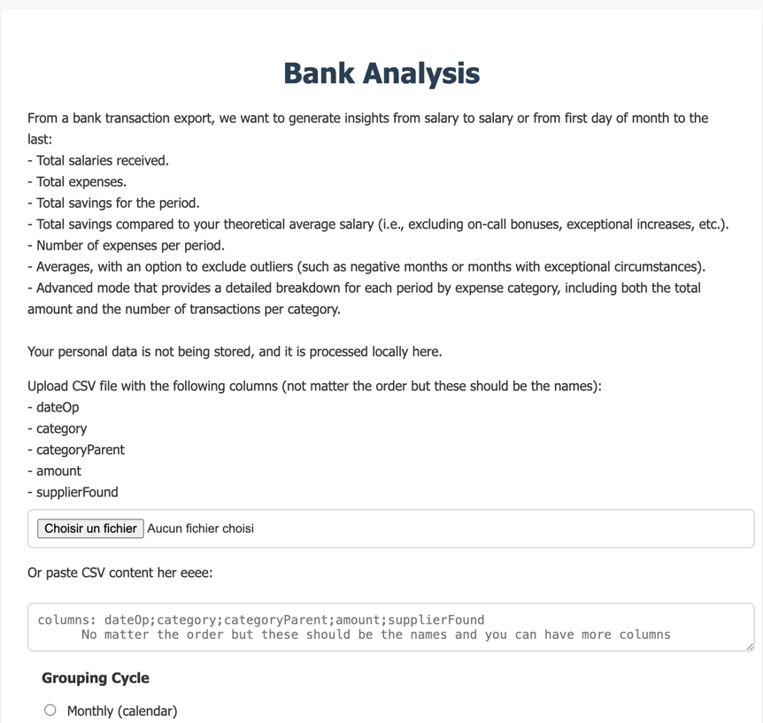
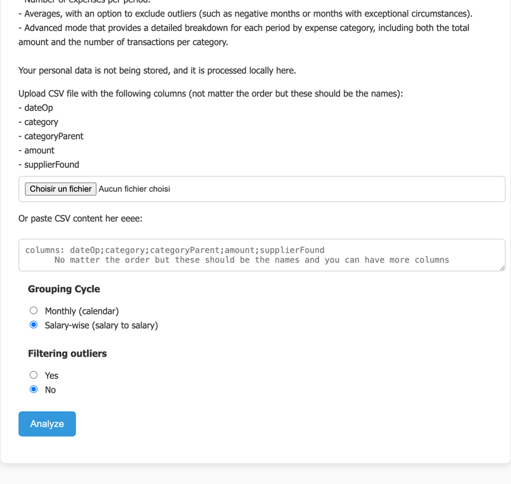
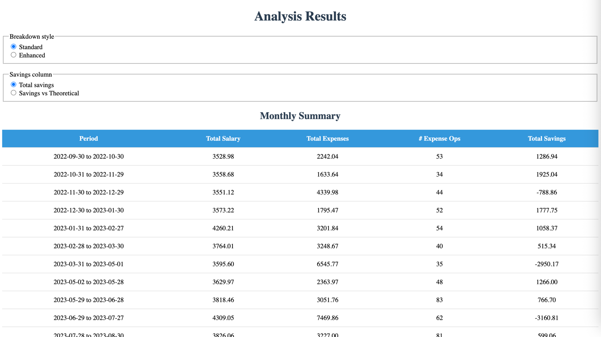
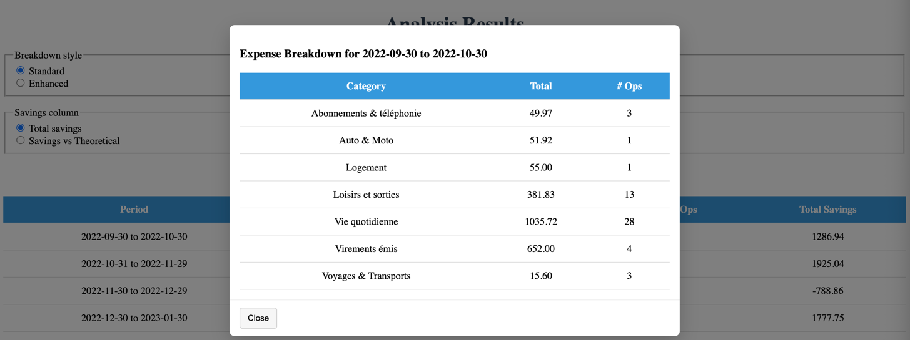
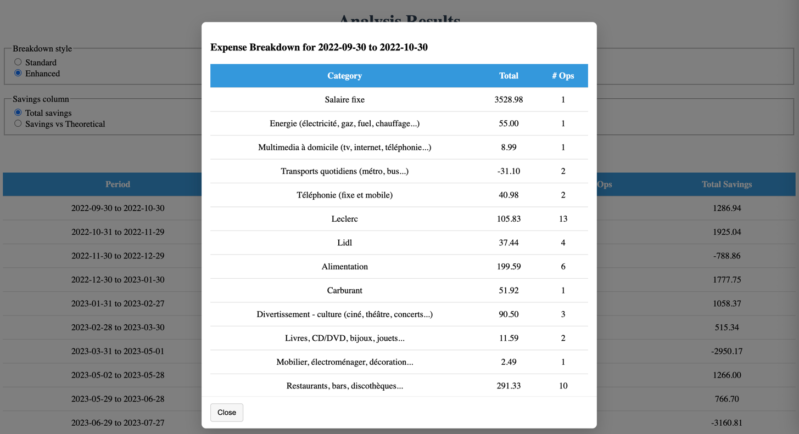

# Bank Analysis Project

From a bank transaction export, we want to generate monthly insights including:

The total salaries received.<br/>
The total expenses incurred.<br/>
The total savings for the month.<br/>
The total savings compared to your theoretical average salary (i.e., excluding on-call bonuses, exceptional increases, etc.).<br/>
The number of expense transactions per month.<br/>
The ability to compute averages, with an option to exclude outliers (such as negative months or months with exceptional circumstances).<br/>
An advanced mode that provides a detailed breakdown for each month by expense category, including both the total amount and the number of transactions per category.<br/>

The implementation is in Python 3.

## Structure
- adapters 
- domain
- entrypoints
- ports
- usecases


This is a trial at Hexagonal Architecture and here are some reminders:
<br/>
Domain must NOT import or call Adapters or Entrypoints.<br/>
Domain code should not import CSV loader, DB code, HTTP code, filesystem code, or any I/O.<br/>
Domain must NOT depend on concrete Presenter implementations or DB libraries.<br/>
It can depend on Ports (interfaces) only if you choose to define output ports in domain, but it's often better to keep ports in their own layer imported by both domain/use-cases and adapters.<br/>
<br/>

Use-cases (application) must NOT import concrete Adapters directly (except to be wired at bootstrap).<br/>
Use-cases depend on Ports (interfaces) and Domain; wiring code (entrypoint/bootstrap) provides adapter instances that implement those ports.<br/>
<br/>

Ports must NOT import Adapters or Entrypoints.<br/>
Ports are plain interfaces/protocols only; implementations live outside.<br/>
<br/>

Adapters must NOT call Domain internals other than via the ports they implement or by invoking use-cases through ports — they implement the port interfaces and can call domain models where appropriate, but they must not import/use private domain internals that break encapsulation.<br/>
<br/>

Entrypoints/UI must NOT contain domain/business logic; they may call use-cases and present results.<br/>

Allowed interactions (examples)<br/>
<br/>

Entrypoints → Use-cases<br/>
Use-cases → Domain (invoke domain functions/entities)<br/>
Use-cases → Ports (call repository or output ports)<br/>
Adapters → Ports (implement repository/presenter interfaces)<br/>
Adapters → Domain models (only for constructing/transforming data) — but avoid business logic here<br/>


## Exécution
For the cli version
```bash
python main.py
```
or for the UI version
```bash
python app.py
```

## Tests
```bash
pytest --maxfail=1 --disable-warnings -q
```

This app automatically deploys in Render at https://bank-analysis-6p5q.onrender.com/
And you can test it there.

Here are some screenshots: 




